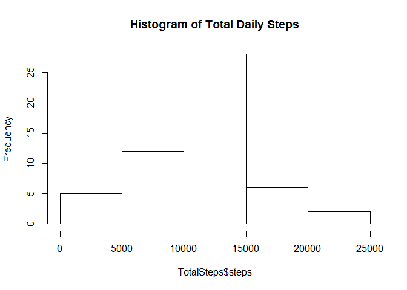
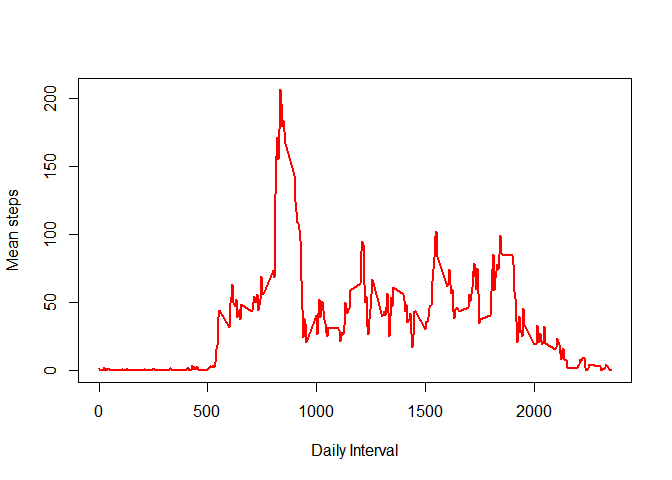
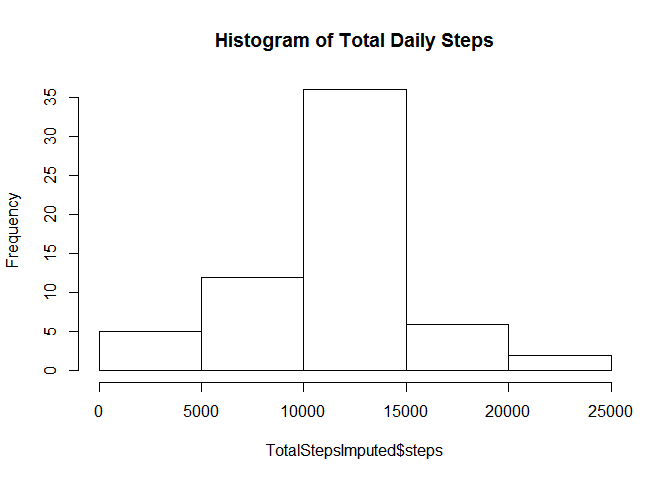
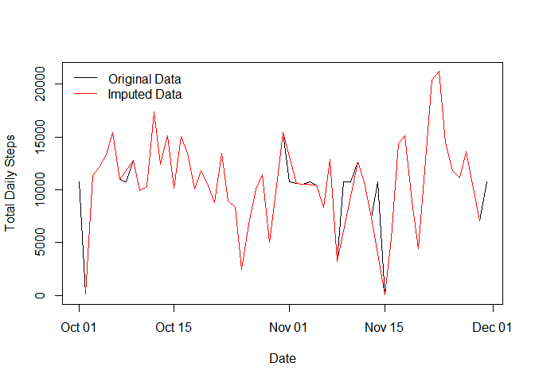

Assignment 1
------------

Load and preprocess the data
============================

    x<-read.csv("activity.csv",header=TRUE) 
    #Look at data characteristics
    head(x)

    ##   steps       date interval
    ## 1    NA 2012-10-01        0
    ## 2    NA 2012-10-01        5
    ## 3    NA 2012-10-01       10
    ## 4    NA 2012-10-01       15
    ## 5    NA 2012-10-01       20
    ## 6    NA 2012-10-01       25

    str(x)

    ## 'data.frame':    17568 obs. of  3 variables:
    ##  $ steps   : int  NA NA NA NA NA NA NA NA NA NA ...
    ##  $ date    : Factor w/ 61 levels "2012-10-01","2012-10-02",..: 1 1 1 1 1 1 1 1 1 1 ...
    ##  $ interval: int  0 5 10 15 20 25 30 35 40 45 ...

    # Convert date to a date format instead of a factor format
    x$date<-as.Date(x$date, "%Y-%m-%d") 
    # create a separate dataframe that excludes rows with NA values
    x2<- x[complete.cases(x),]

Part 1. What is mean and median total number of steps taken per day? Show a histogram.
======================================================================================

    TotalSteps<-aggregate(x2$steps, by=list(x2$date), FUN=sum)
    colnames(TotalSteps)<-c("Date","steps")

    #Histogram of the toal number of steps taken each day
    hist(TotalSteps$steps,main="Histogram of Total Daily Steps")

    #Calculate the mean and median of th total number of steps taken per day
    mean(TotalSteps$steps)

    ## [1] 10766.19

    median(TotalSteps$steps)

    ## [1] 10765

Part 2.What is the average daily activity pattern?
==================================================

    #1. Make a time series plot (i.e. type = "l") of the 5-minute interval (x-axis) and the average number of steps taken, averaged across all days (y-axis)
    b<-aggregate(x2$steps, by=list(x2$interval), FUN=mean)
    colnames(b)<-c("interval","steps")
    plot(b$interval,b$steps,type="l",lwd=2,col="red",ylab="Mean steps",xlab="Daily Interval")

    #2. Which 5-minute interval, on average across all the days in the dataset, contains the maximum number of steps?
     b[(b$steps)==max(b$steps),]

    ##     interval    steps
    ## 104      835 206.1698

Part 3. Imputing missing values
===============================

    #1. Calculate and report the total number of missing values in the dataset (i.e. the total number of rows with NAs)

    #Take the difference between rows in the full dataset and rows in the dataset without NA's
    length(x$date)-length(x2$date)

    ## [1] 2304

    #2 and 3. Create a new dataset that is equal to the original dataset but with the missing data filled in.
    #We will replace the missing NA's with the average number of steps taken for the interval, calculated in the previous step

    #First, merge the full dataset(x) with the dataset containing imputed values 
    impute<-merge(b,x, by="interval")
    colnames(impute)<-c("interval","imputed_steps","steps","date")

    #Create a column contaiing the actual steps if the value is present and the imputed steps if the value was NA
    impute$complete <- with(impute, ifelse(is.na(steps),imputed_steps,steps)) 

    #Check
    head(impute)

    ##   interval imputed_steps steps       date complete
    ## 1        0      1.716981    NA 2012-10-01 1.716981
    ## 2        0      1.716981     0 2012-11-23 0.000000
    ## 3        0      1.716981     0 2012-10-28 0.000000
    ## 4        0      1.716981     0 2012-11-06 0.000000
    ## 5        0      1.716981     0 2012-11-24 0.000000
    ## 6        0      1.716981     0 2012-11-15 0.000000

    #cleanup the dataset to contain the interval, date, and complete data for setps
    imputed<-impute[,c(1,4:5)]

    #4. Make a histogram of the total number of steps taken each day and Calculate and report the mean and median total number of steps taken per day. Do these values differ from the estimates from the first part of the assignment? What is the impact of imputing missing data on the estimates of the total daily number of steps?
    TotalStepsImputed<-aggregate(impute$complete, by=list(impute$date), FUN=sum)
    colnames(TotalStepsImputed)<-c("Date","steps")

    #Histogram of the toal number of steps taken each day
    hist(TotalStepsImputed$steps,main="Histogram of Total Daily Steps")

    # mean and median of imputed dataset
    mean(TotalStepsImputed$steps)

    ## [1] 10766.19

    median(TotalStepsImputed$steps)

    ## [1] 10766.19

    #mean and median of dataset without imptation
    mean(TotalSteps$steps)

    ## [1] 10766.19

    median(TotalSteps$steps)

    ## [1] 10765

    # no the estimates are similar.  

    # What is the impact of imputing missing data on the estimates of the total daily number of steps?
    plot(TotalStepsImputed$Date,TotalStepsImputed$steps, type = "l",xlab="Date",ylab="Total Daily Steps")
    points(TotalSteps$Date,TotalSteps$steps, type="l", col="red")
    legend("topleft",c("Original Data","Imputed Data"),col=c("black","red"),lty=c(1,1),bty='n')

    # the impact is minimal

PArt 4. Are there differences in activity patterns between weekdays and weekends?
=================================================================================

    #1. Create a new factor variable in the dataset with two levels – “weekday” and “weekend” indicating whether a given date is a weekday or weekend day.

    # first, determine the days of the week then assign them to categories of weekend and weekday
    imputed$days<-weekdays(imputed$date,abbreviate = TRUE)
    imputed$days2 <- with(imputed, ifelse(days != "Sat" & days !=  "Sun","weekday","weekend"))
    imputed$days2<-as.factor(imputed$days2)
    head(imputed)

    ##   interval       date complete days   days2
    ## 1        0 2012-10-01 1.716981  Mon weekday
    ## 2        0 2012-11-23 0.000000  Fri weekday
    ## 3        0 2012-10-28 0.000000  Sun weekend
    ## 4        0 2012-11-06 0.000000  Tue weekday
    ## 5        0 2012-11-24 0.000000  Sat weekend
    ## 6        0 2012-11-15 0.000000  Thu weekday

    str(imputed)

    ## 'data.frame':    17568 obs. of  5 variables:
    ##  $ interval: int  0 0 0 0 0 0 0 0 0 0 ...
    ##  $ date    : Date, format: "2012-10-01" "2012-11-23" ...
    ##  $ complete: num  1.72 0 0 0 0 ...
    ##  $ days    : chr  "Mon" "Fri" "Sun" "Tue" ...
    ##  $ days2   : Factor w/ 2 levels "weekday","weekend": 1 1 2 1 2 1 2 1 1 2 ...

    #2. Make a panel plot containing a time series plot (i.e. type = "l") of the 5-minute interval (x-axis) and the average number of steps taken, averaged across all weekday days or weekend days (y-axis). See the README file in the GitHub repository to see an example of what this plot should look like using simulated data.

    weekdays<-imputed[imputed$days2=="weekday",]
    weekends<-imputed[imputed$days2=="weekend",]

    week_steps<-aggregate(weekdays$complete, by=list(weekdays$interval), FUN=mean)
    weekend_steps<-aggregate(weekends$complete, by=list(weekends$interval), FUN=mean)

    #create a dataframe for a panel plot
    category<-rep("weekday",length(week_steps$x))
    wkdays<-data.frame(week_steps,category)
    category2<-rep("weekend",length(weekend_steps$x))
    wkends<-data.frame(weekend_steps,category2)

    colnames(wkdays)<-c("interval","steps","day")
    colnames(wkends)<-c("interval","steps","day")
    data<-rbind(wkdays,wkends)

    library(lattice)
    xyplot(steps~interval | factor(day), data=data, type="l",xlab="Interval",ylab= "Number of steps",layout=c(1,2))

